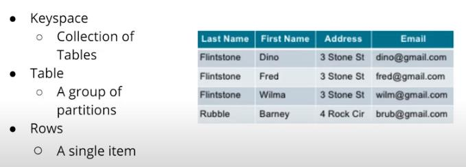

##  What is Data Modeling

데이터 모델링이란, 데이터 베이스 모델링을 하기위한 추상적인 프로세스이다.

이 프로세스 안에는 데이터 요소와 이들이 서로 관련되는 방식을 구성하는것,

구성한 데이터로 첫 번째 행과 열 집합을 만드는 프로세스 이다.

데이타 모델링은 데이터 베이스 모델링으로 쉽게 변환 될 수 있고,

데이터 모델링은 쉽게 데이터 베이스 모델링이라고 할 수 있다.

---

#### Data Modeling Process

Conceptual Data Modeling -> Logical Data Modeling -> Physical Data Modeling -> DDL

* Conceptual Data Modeling

  이미 갖고 있거나 가질 데이터의 개념을 매핑하는 것이다.

  실제 데이터 모델링은 엔티티 매핑을 사용한 개념적 데이터 모델링으로 시작된다.

  이 작업은 수작업으로 수행하거나 많은 도구를 사용하여 수행 할 수 있다.

  Columm에 메모와 제목을 적어 두는 순간, 개념적 데이터 모델링을 한 것과 같다.

* Logical Data Modeling

  Context Model이 Mapping 되는 위치에서 Table, Schema 및 Columm 개념을 사용하는 논리 모델에

  Logical Data Modeling Process가 수행된다.

* Pysical Data Modeling

  Logical Data Model에 내용을 채우는 과정이다.

* DDL

  데이터베이스가 이해하는 방식으로 테이블을 생성하기 위해 DDL을 작성 해야 한다.

---

## Relational Databases

* Relational Model 

  이 모델은 데이터를 하나 이상의 테이블 또는 각 행을 식별하는 고유키가 있는 열과 행의 관계 모델이다

Relational Database 는 데이터의 Relational Model을 기반으로 하는 디지털 데이터베이스이다.

Relational Database를 유지하는데 사용되는 소프트웨어 시스템을 RDBMS라고 한다.

* SQL

  SQL은 데이터베이스를 쿼리하고 유지하기 위한 거의 모든 관계형 데이터베이스 시스템이다

  따라서 SQL은 데이터베이스와 상호 작용하는데 사용할 언어이다.

---

## When to use a relational database?

* JOINS을 수행하는 기능을 사용할때
* 집계 및 분석 기능이 필요할때 (group by, order by)
* 데이터의 볼륨이 작을 때
* 비즈니스의 요구 사항이 자주 변경될때
* 쿼리를 모델링하지 않고 데이터를 모델링 하고 싶을때(데이터 모델링과 쿼리를 독립저긍로 갖고 싶을때)
* Secondary Indexe(보조 인덱스)의 이점을 얻고 싶을때
* ACID Transactions의 기능을 추가 하고싶을때 (데잍터의 무결성을 갖고 싶을때)

---

## ACID Transactions

ACID property는  database transaction의 property이다.

오류 또는 정전시에도 유효성을 보장한다.

ACID transaction은 데이터의 무결성을 보장한다.

* Propery

  Atomicity(원자성), Consistency(일관성), Isolation(격리), Durabilty(내구성)

* Atomicty

  전체 transacion이 처리되거나 아무것도 처리되지 않는다.

* Consistency

  준수하는  transaction만 제약과 규칙이 데이터베이스에 기록된다. 

  그렇지 않으면 데이터베이스가 이전 상태를 유지한다.

* Isolation

  transaction은 독립적이고 안전하게 처리된다. 

  쿼리가 수행중인 데이터에 대해선 다른 쿼리가 상호작용 할 수 없다.

* Durability 

  완료된 transanction은 시스템 장애시에도 데이터베이스에 저장된다.

  transaction이 commit 되는 순간 비 휘발성 메모리에 기록된다.

---

## When Not to use a Relational Database?

* 많은 양의 데이터가 있는 경우, 또는 다른 데이터 형식으로 데이터를 저장할 수 있어야 할때

  relational database는 분산 데이터베이스가 아니기 때문이다.

* 높은 처리량이나 빠른 읽기가 필요한 경우

  ACID transaction을 사용하는 동안 데이터를 읽고 쓰는 과정이 느려진다.

* 유연한 스키마가 필요한 경우

* 높은 가용성이 필요한 경우

  데이터베이스가 다운됬을때 백업 시스템으로의 장애 조치가 느리다.

* 수평 확장이 필요한 경우

  relational database는 서버를 추가로 확장할 수 없다.

---

## NoSQL Databases
 * 수평 확장이 간단하다.
 * 가용성을 더 세밀하게 제어한다.
  * NoSQL 과 SQL의 데이터 구조가 다르기 때문에 SQL Database 보다 일부 작업이 더 빠르다.

#### Common Types of NoSQL Databases
 * Apache Cassandra - Partition Row store      
  데이터는 노드 또는 서버에서 분할로 분산되고, 열 및 행 형식으로 구성된다.
 * MongDB - Document store             
 문서 지향 데이터베이스는 키-값 저장소에서 수행하는 키 조회 외에도 콘텐츠를 기반으로 문서를 검색하는 쿼리 언어이다.        
기본적으로 문서 검색이 쉽다.
* DynamoDB - Key-Value store        
key-value store는 기본적으로 데이터가 key-value 형태로 표시된다.        
* Apache HBase - Wide Column Store        
Relational Dabase와 같ㅇ리 테이블, 행 및 열을 사용하지만 열의 이름과 형식은 동일한 테이블의 행마다 다를 수 있다. 때문에 유연한 스키마를 갖는다.        
* Neo4J - Graph Database         
 그래프 데이터베이스는 엔티티 간의 관계에 더 중점을 두는 데이터베이스이다.        
데이터는 노드와 간선으로 표현된다.

#### Basics of Apache Cassandra

---
## When to Use a NoSql Database
 * 많은 데이터가 있을때
 * 서버 확장이 필요할때
 * 많은 데이터 처리가 필요 할때 (읽기/쓰기)
 * 유연한 스키마가 필요할 때
 * 높은 가용성이 필요할 때
 * 다른 데이터 유형과 형식을 저장할 수 있어야 할 때
 * 사용자가 분산되어 있고 사용에게 낮은 지연 시간을 유지해야 할 때

## When to not use a NoSQL Database?
* ACID Transactions이 필요할 때
* JOINS 기능이 필할 때 (분산되어 있는 전체 서버에 접근하기 힘듬)
* 집계 및 통계 기능이 필요할 때 (전체 테이블 조회하기 힘듬)
* 데이터의 구조를 바꿀수도 있을때
* 적은 데이터만 있을떄
