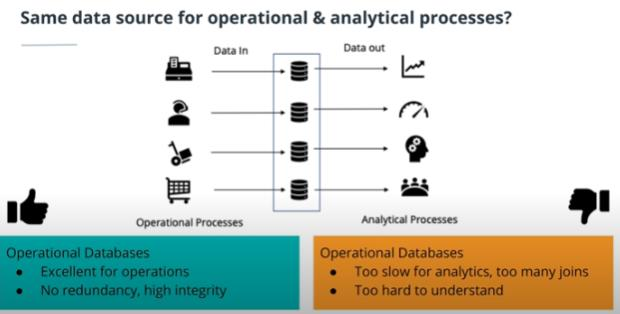
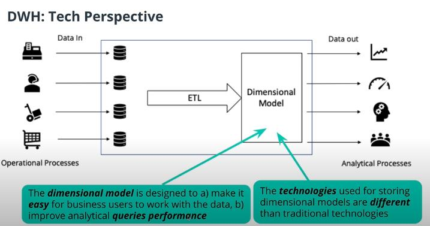

## What is a Data Warehouse
* 데이터 웨어하우스는 방대한 조직 내에서 분산 운영되는 각각의 데이터 베이스 관리 시스템들을 효율적으로 통합하여 조정, 관리 한다.
* 데이터 웨어하우스의 구성은 관리 하드웨어, 관리 소프트웨어, 추출ㆍ변환ㆍ정렬 도구, 데이터 베이스 마케팅 시스템, 메타 데이터, 최종 사용자 접근 및 활용 도구등 으로 구성되어 있다.
* 전략적 관점에서 효율적인 의사 결정을 지원하기 위해 데이터의 시계열적 축적과 통합을 목표로 한다.
* 데이터 웨어하우스는 경영자의 의사 결정을 지원하는 데이터의 집합체로 주제 지향적, 통합적, 시계열적, 비휘발적 특성을 갖는다.

### Perspective
*  데이터 웨어하우스는 비지니스 관점, 기술적 관점으로 볼 수 있다.

 먼저 비지니스 관점에서 보면 운영 프로세스, 분석 프로세스로 나눌 수 있는데 운영 프로세스에선 데이터를 모으고 분석 프로세스에서는 모인 데이터를 분석한다. 하지만 이 둘이 같은 데이터를 쓴다면 데이터를 모으는 운영 프로세스는 필요해보이는 데이터를 모두 모으기 때문에 별 문제가 없지만, 분석 프로세스에서는 전략적 관점에서 데이터를 분석해야하기 때문에 데이터 분석이 불편하다. 그래서 기술적 관점에서 보는 것이 필요하다.

먼저 ETL을 통해 데이터를 가공한다.

모델은 비지니스 사용자가 쉽게 작업 할 수 있도록 설계 해야하고, 빠른 분석을 위해 쿼리 성능을 높여야 한다.

시각적(그래프, 차트)으로 보여주기 위한 애플리케이션이 필요하다.

* 기술적인 목표는 다음과 같다.
    * 비지니스 사용자가 이해하기 쉬워야 한다.
    * 품질 및 성능이 좋아야 한다.
    * 새로운 쿼리를 처리를 유연하게 할 수 있어야한다.
    * 보안이 유지 되어야 한다.

### Dimensional Modeling
차원 모델링이란 데이터웨어 하우스 설계에 사용하기위한 일련의 방법, 기술 및 개념을 포함한 Business Dimensional Lifecycle methodology 방법론의 일부이다.
비즈니스 내의 주요 비즈니스 프로세스를 식별하고 추가 비즈니스 프로세스를 추가하기 전에 이를 먼저 모델링하고 구현하는데 중점을 둔다.

OLAP 환경을 이용하는 비즈니스 사용자가 이해하기 쉬워야 하며 분석을 위한 빠른 쿼리가 필요하다. 그러므로 3NF로 정규화된 모델링 보다는 `Star Schema`로 구성한다.

### Facts & Dimensions

스타 스키마를 알기 위해선 스타 스키마를 구성하는 `Fact,Dimension Table` 을 알아야 한다.

`Fact Table` 이란 일반적으로 집계 할수 있는 숫자 값이며 `Dimension Table` 들의 
`Foreign Key`를 값으로 갖는 중앙에 위치하는 테이블이다.

`Dimension Table`이란 `Fact Table`에 대한 데이터를 갖고 있는 테이블이다. 

