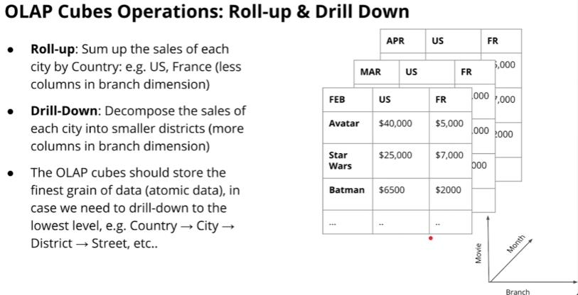
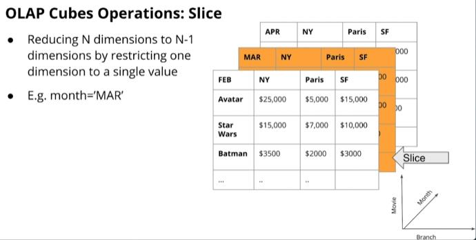
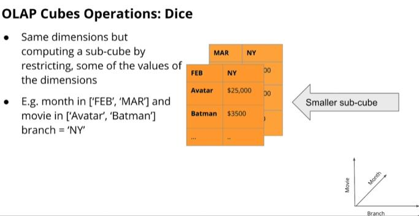

## OLAP Cubes

`OLAP`는 insight한 데이터를 분석해서 찾기 위한 기술이며
`Cube`는 다차원 데이터 집합을 나타낸다.    
따라서 `OLAP Cube` 는 insight 데이터를 분석하기 위한 다차원 데이터 집합이라 볼수 있으며 위의 그림 처럼 큐브는 2차원 또는 3차원 스프레드 시트의 다차원 일반화로 간주 될 수 있다.        
이렇게 데이터를 계층적 차원이 있는 큐브로 인식하면 분석을 도와주는 개념적으로 간단한 작업 4가지(rollup, drill-down, slice, dice)가 있다.

### Roll-up & Drill Down

* `Roll-up`이란 위의 사진 처럼 City 차원을 Country로 그룹화 한것이다.
* `Drill down` 이란 roll-up 의 반대 과정을 하는 것이다. 
* 여러 측면에서 분석하기 위해 roll-up, drill down 을 사용할 수 있으므로 OLAP cubes에 atomic data로 저장을 해야 한다.

### Slice

### Dice

### Query Optimization

slice, dice, rollup, drill-drown을 사용하게 되면 많은 JOIN을 사용하게 된다.	

그래서 `group by cube` 문을 사용하게 되면 가능한 모든 조합을 찾아서 보여주기 때문에 많은 JOIN문을 사용하는 operation보다 성능을 높힐수 있다.